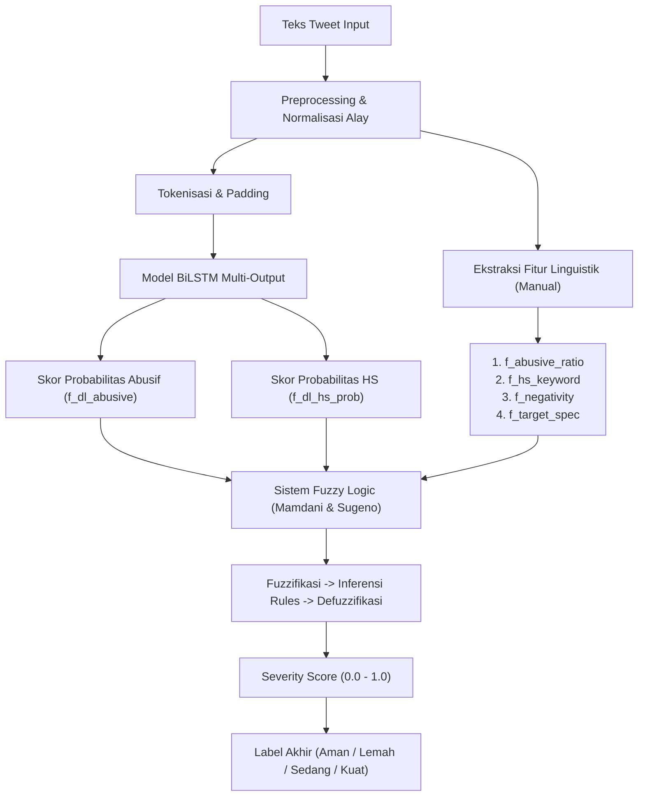

# 🔴 Walkthrough Lengkap: `hate_speech_fuzzy_dl_FIXED.ipynb`

Dokumen ini menjelaskan struktur, alur kerja, integrasi, dan hasil eksperimen dari notebook `hate_speech_fuzzy_dl_FIXED.ipynb` yang mengimplementasikan sistem **Hybrid Deteksi Hate Speech Bahasa Indonesia** menggabungkan **Deep Learning (BiLSTM)** dan **Fuzzy Logic (Mamdani & Sugeno)**.

---

## 📐 Arsitektur Sistem (Overview)

Sistem ini adalah sistem hibrida (hybrid). Model **Deep Learning (BiLSTM)** tidak menggantikan **Fuzzy Logic**, melainkan berperan sebagai **Feature Extractor**. 

Berikut adalah diagram alur bagaimana teks tweet diproses hingga menghasilkan klasifikasi akhir:



### 🧠 Integrasi Deep Learning ke Fuzzy (Menjawab Pertanyaan Kunci)
> [!IMPORTANT]
> **Bagaimana hasil BiLSTM dimasukkan ke model Fuzzy?**
> Output prediksi dari model BiLSTM (berupa nilai probabilitas kontinu `[0, 1]`) dimasukkan kembali ke DataFrame utama sebagai fitur tambahan:
> 1. `f_dl_abusive`: Probabilitas kata abusif dari BiLSTM (Fitur Fuzzy ke-5, Utama)
> 2. `f_dl_hs_prob`: Probabilitas hate speech dari BiLSTM (Fitur Fuzzy ke-6, Opsional)
>
> Kedua fitur dinamis hasil deep learning ini kemudian digabungkan bersama 4 fitur linguistik manual untuk dimasukkan ke dalam kelas `FuzzyMamdani` dan `FuzzySugeno` melalui parameter `predict(ar, hs, neg, tgt, dl, dlhs)`.

---

## 📦 Bagian 1: Import Library & Setup

**Cell:** `execution_count: 1`

Tahap awal untuk mempersiapkan environment dengan library yang dibutuhkan:
- **Manipulasi Data & Matematika**: `numpy`, `pandas`
- **Visualisasi**: `matplotlib.pyplot`, `seaborn`
- **Natural Language Processing (NLP)**: `re`, `string`, `collections.Counter`
- **Deep Learning (TensorFlow/Keras)**: `Tokenizer`, `pad_sequences`, `Model`, `Input`, `Embedding`, `Bidirectional`, `LSTM`, `GlobalMaxPooling1D`, `Dense`, `Dropout`
- **Evaluasi & Metrik**: `sklearn.metrics` (`classification_report`, `confusion_matrix`, `accuracy_score`, `f1_score`, `roc_auc_score`, `mean_absolute_error`, `mean_squared_error`)
- **Skala Fitur**: `MinMaxScaler`

*Random seed* diset ke `42` untuk memastikan hasil eksperimen bersifat *reproducible* (konsisten saat dijalankan ulang).

---

## 📊 Bagian 2: Load Dataset

**Cell:** `execution_count: 2-3`

Memuat data dari folder `data/` yang telah dirapikan:
1. `data/data.csv` (13,169 tweet dengan multi-label hate speech dan abusive)
2. `data/abusive.csv` (125 entri kata-kata abusif dalam bahasa Indonesia)
3. `data/new_kamusalay.csv` (15,166 baris kamus pemetaan kata tidak baku/slang ke baku)

Notebook menampilkan visualisasi distribusi kelas `HS` (Hate Speech) dan `Abusive` menggunakan bar chart untuk memahami keseimbangan data.

---

## 🧹 Bagian 3: Preprocessing Teks

**Cell:** `execution_count: 4`

Fungsi `preprocess_text(text)` bertugas membersihkan teks mentah melalui pipeline berikut:
1. **Case Folding**: Mengubah teks menjadi lowercase.
2. **Noise Removal**: Menghapus token khusus (`USER`, `RT`, `URL`), link web, emoji, spasi berlebih, serta karakter non-alfanumerik.
3. **Alay Normalization**: Menggunakan kamus `new_kamusalay.csv` untuk memetakan kata tidak baku menjadi kata baku (misalnya: *yg* $\rightarrow$ *yang*, *bgt* $\rightarrow$ *banget*).

Hasil pembersihan disimpan pada kolom baru bernama `clean_tweet`.

---

## 🔧 Bagian 4: Feature Engineering untuk Fuzzy (Fuzzy Input Features)

**Cell:** `execution_count: 5`

Mengekstrak fitur-fitur linguistik (manual) dari teks tweet yang sudah bersih:

| Variabel Fitur | Jenis Deskripsi | Rentang Nilai |
| :--- | :--- | :--- |
| `f_abusive_ratio` | Rasio jumlah kata abusif dibandingkan total seluruh kata dalam tweet. | `[0.0, 1.0]` |
| `f_hs_keyword` | Skor kemunculan kata kunci khas hate speech (lexicon-based). | `[0.0, 1.0]` |
| `f_negativity` | Skor keberadaan kata negasi/negativitas yang membalikkan/memperkuat makna. | `[0.0, 1.0]` |
| `f_target_spec` | Skor target spesifik (menghitung bobot jika menyasar Individu/Grup, Agama, Ras, dll). | `[0.0, 1.0]` |
| `f_dl_abusive` | Probabilitas teks bersifat abusif berdasarkan prediksi model BiLSTM (diisi nanti). | `[0.0, 1.0]` |
| `f_dl_hs_prob` | Probabilitas teks mengandung hate speech berdasarkan prediksi BiLSTM (diisi nanti). | `[0.0, 1.0]` |

---

## 🧠 Bagian 5: Deep Learning — Model BiLSTM Multi-Output

### 5a. Tokenisasi & Train-Test Split
**Cell:** `execution_count: 6-7`
- Teks tweet dikonversi menjadi barisan indeks angka (*sequences*) menggunakan Keras `Tokenizer` dengan batasan `MAX_WORDS = 20000`.
- Barisan angka di-*pad* menggunakan `pad_sequences` dengan `MAX_LEN = 100` agar panjang input seragam.
- Dataset dibagi menjadi **80% training** dan **20% testing** dengan pembagian terlapis (*stratify*) berdasarkan label `Abusive`.

### 5b. Arsitektur Model BiLSTM Multi-Output
**Cell:** `execution_count: 8-9`
Arsitektur model dirancang memiliki **dua output utama (multi-output)** agar efisien:
- **Input Layer**: Menerima sequence berukuran `100`.
- **Embedding Layer**: Memetakan indeks kata ke dalam vektor dimensi `128`.
- **Bidirectional LSTM**: 128 unit (menangkap konteks teks dari depan ke belakang dan sebaliknya).
- **GlobalMaxPooling1D**: Mengambil fitur paling menonjol di sepanjang dimensi waktu sequence.
- **Dense & Dropout Layer**: Layer penghubung dengan 64 neuron (aktivasi ReLU) dan Dropout 0.3 untuk mencegah overfitting.
- **Output 1 (Abusive Head)**: Dense layer (1 output, aktivasi Sigmoid) untuk memprediksi probabilitas abusif.
- **Output 2 (Hate Speech Head)**: Dense layer (1 output, aktivasi Sigmoid) untuk memprediksi probabilitas hate speech.

Model di-compile menggunakan optimizer `Adam`, loss function `binary_crossentropy` untuk masing-masing output dengan bobot seimbang (`loss_weights={'abusive_output': 0.5, 'hs_output': 0.5}`).

### 5c. Training & Early Stopping
**Cell:** `execution_count: 10`
Model dilatih selama 15 epoch dengan `EarlyStopping` (patience = 3). Pelatihan berhenti otomatis di epoch 6 karena validation loss mulai mengalami stagnasi/kenaikan.

### 5d. Penambahan Fitur Deep Learning ke DataFrame
**Cell:** `execution_count: 11`
Model BiLSTM memprediksi seluruh dataset, kemudian hasilnya dimasukkan ke kolom dataframe:
```python
df['f_dl_abusive'] = y_prob_abusive_all  # Fitur Fuzzy ke-5
df['f_dl_hs_prob'] = y_prob_hs_all       # Fitur Fuzzy ke-6 (analisis tambahan)
```

---

## 📐 Bagian 6: Fungsi Keanggotaan Fuzzy (Membership Functions)

**Cell:** `execution_count: 12-15`

Mendefinisikan fungsi keanggotaan matematis menggunakan pendekatan dari awal (*from scratch*):
- `trimf(x, a, b, c)`: Fungsi Keanggotaan Segitiga (Triangular MF)
- `trapmf(x, a, b, c, d)`: Fungsi Keanggotaan Trapesium (Trapezoidal MF)

### 📈 Variabel Input Keanggotaan (Fuzzy Inputs)
Setiap input dipetakan ke dalam 3 himpunan fuzzy (misalnya: `rendah`, `sedang`, `tinggi` atau `positif`, `netral`, `negatif`):
- **f_abusive_ratio**: `rendah`, `sedang`, `tinggi`
- **f_hs_keyword**: `rendah`, `sedang`, `tinggi`
- **f_negativity**: `positif`, `netral`, `negatif`
- **f_target_spec**: `umum`, `sedang`, `spesifik`
- **f_dl_abusive**: `rendah`, `sedang`, `tinggi`
- **f_dl_hs_prob**: `rendah`, `sedang`, `tinggi`

### 📉 Variabel Output (Fuzzy Output Severity)
Output didefinisikan ke dalam 4 tingkat keparahan (*severity score* dari `0.0` sampai `1.0`):
- `aman` (Trapesium: 0.0 - 0.25)
- `lemah` (Segitiga: 0.20 - 0.50)
- `sedang` (Segitiga: 0.45 - 0.75)
- `kuat` (Trapesium: 0.70 - 1.00)

Grafik fungsi keanggotaan ini divisualisasikan dan disimpan secara otomatis di file `images/membership_functions.png`.

---

## 🔀 Bagian 7: Fuzzy Logic Mamdani

**Cell:** `execution_count: 16-21`

### 📜 Aturan Fuzzy (Rule Base)
Mendefinisikan kumpulan aturan logika (IF-THEN) yang ditulis secara terstruktur. Aturan ini menggabungkan fitur linguistik manual dengan fitur dari BiLSTM.
Contoh Rule:
- `IF abusive_ratio is tinggi AND hs_keyword is tinggi AND dl_abusive is tinggi THEN severity is kuat` (Weight = 1.0)
- `IF abusive_ratio is rendah AND hs_keyword is rendah AND dl_abusive is rendah THEN severity is aman` (Weight = 1.0)

### ⚙️ Alur Inferensi Mamdani:
1. **Fuzzifikasi**: Menghitung derajat keanggotaan $\mu(x)$ untuk semua input berdasarkan fungsinya.
2. **Evaluasi Aturan**: Menggunakan operator `AND` (mencari nilai **minimum** dari derajat keanggotaan variabel yang terlibat dalam aturan).
3. **Agregasi**: Menggabungkan hasil aktivasi seluruh aturan menggunakan metode **max** untuk membentuk satu area fuzzy output terpadu.
4. **Defuzzifikasi Centroid**: Menghitung titik pusat gravitasi (Center of Gravity/CoG) dari area agregasi untuk menghasilkan nilai *crisp score* antara 0.0 hingga 1.0.

### 🎯 Threshold Optimization (F2-Score)
Mengoptimalkan nilai ambang batas (*threshold*) klasifikasi biner hate speech. Karena deteksi hate speech mengutamakan keselamatan pengguna, pengoptimalan berfokus pada **F2-Score** (mengutamakan *Recall* agar sesedikit mungkin hate speech yang terlewat). Nilai threshold optimal yang ditemukan untuk Mamdani adalah sekitar **0.25 - 0.26**.

---

## 🔀 Bagian 8: Fuzzy Logic Sugeno

**Cell:** `execution_count: 22-23`

### 💡 Perbedaan Utama dengan Mamdani:
Jika Mamdani menghasilkan daerah/himpunan fuzzy pada outputnya, **Sugeno** menyederhanakan output aturan menjadi suatu **nilai konstan (singleton)**:
- Output `aman` = `0.10`
- Output `lemah` = `0.35`
- Output `sedang` = `0.55`
- Output `kuat` = `0.85`

### ⚙️ Defuzzifikasi Sugeno:
Menggunakan metode **Weighted Average (Rata-rata Terbobot)** dari kekuatan aturan (*firing strength*) $\mu_i$ dengan nilai output konstan $z_i$:
$$\text{Output} = \frac{\sum (\mu_i \times z_i)}{\sum \mu_i}$$

Sugeno lebih efisien secara komputasi dan tidak membutuhkan proses integrasi area centroid yang berat seperti Mamdani.

---

## 📊 Bagian 9: Visualisasi Proses Fuzzy (Single Sample Walkthrough)

**Cell:** `execution_count: 24`

Menampilkan analisis *end-to-end* secara visual pada satu contoh tweet konkret. Menunjukkan bagaimana nilai input crisp diubah menjadi derajat keanggotaan, aturan mana saja yang teraktivasi, kekuatan firing rules, hingga hasil akhir defuzzifikasi Centroid. 

Grafik proses ini disimpan di `images/mamdani_process.png`.

---

## 📊 Bagian 10: Evaluasi & Perbandingan Sistem

**Cell:** `execution_count: 25-31`

Membandingkan performa regresi (MAE, MSE, RMSE) serta klasifikasi biner antara Fuzzy Mamdani dan Fuzzy Sugeno yang telah terintegrasi dengan Deep Learning:

### 📈 Metrik Hasil Evaluasi Utama (Fixed Metrics)

| Metrik Klasifikasi | Fuzzy Mamdani (Hybrid) | Fuzzy Sugeno (Hybrid) |
| :--- | :---: | :---: |
| **Accuracy (HS)** | **0.8657** | **0.8626** |
| **F1-Score (HS)** | **0.8665** | **0.8634** |
| **ROC-AUC (HS)** | **0.9176** | **0.9166** |
| **MAE (Regresi)** | **0.2467** | **0.2587** |
| **MSE (Regresi)** | **0.0925** | **0.1072** |
| **RMSE (Regresi)** | **0.3041** | **0.3274** |

**Korelasi Hasil Mamdani $\leftrightarrow$ Sugeno**: **0.9952** (menunjukkan bahwa kedua metode fuzzy menghasilkan keputusan yang sangat identik dan konsisten satu sama lain).

Grafik perbandingan performa seluruh sistem dan kurva ROC disimpan pada `images/comparison.png` dan `images/all_systems.png`.

---

## 📊 Bagian 11: Analisis Dampak Integrasi Deep Learning

**Cell:** `execution_count: 32-33`

Untuk membuktikan signifikansi dari integrasi Deep Learning, dilakukan uji coba sistem **Fuzzy Mamdani Tanpa DL** (dengan memaksa input `f_dl_abusive` dan `f_dl_hs_prob` bernilai `0.0`).

Berikut adalah hasil perbandingannya:

```
══════════════════════════════════════════════════════════
Dampak Integrasi Deep Learning pada Sistem Fuzzy
──────────────────────────────────────────────────────────
Metrik              Mamdani + DL       Mamdani Only        Δ
──────────────────────────────────────────────────────────
Accuracy               0.8657             0.6110       +0.2547
F1-Score               0.8665             0.5154       +0.3511
ROC-AUC                0.9176             0.6375       +0.2801
══════════════════════════════════════════════════════════
```

> [!TIP]
> **Kesimpulan Utama:**
> Integrasi representasi semantik teks melalui probabilitas BiLSTM (`f_dl_abusive`) ke dalam sistem Fuzzy memberikan peningkatan performa yang luar biasa dramatis:
> - **Akurasi** meningkat sebesar **+25.47%**
> - **F1-Score** melonjak sebesar **+35.11%** (menandakan minimnya kesalahan prediksi positif palsu / negatif palsu)
> - **ROC-AUC** meningkat sebesar **+28.01%**
>
> Ini membuktikan secara empiris bahwa menggabungkan keunggulan **representasi semantik Deep Learning** dengan **interpretabilitas Fuzzy Logic** menghasilkan sistem hibrida yang sangat unggul.

---

## 🔑 Ringkasan Alur Kerja End-to-End Code

1. **Load Data**: Memuat berkas tweet, kamus alay, dan kamus kata abusif.
2. **Text Clean & Normalisasi**: Menghilangkan noise dan memetakan kata alay ke kata baku.
3. **Fuzzy Linguistic Features**: Mengekstrak rasio kata abusif, skor keyword HS, negativitas, dan bobot target.
4. **BiLSTM Training**: Melatih neural network BiLSTM multi-output untuk mendeteksi label HS dan Abusive secara paralel.
5. **DL Features Assignment**: Memasukkan nilai probabilitas output BiLSTM ke dalam DataFrame sebagai kolom `f_dl_abusive` dan `f_dl_hs_prob`.
6. **Desain Variabel Fuzzy**: Menggambar fungsi keanggotaan segitiga dan trapesium untuk input dan output.
7. **Inferensi Mamdani & Sugeno**: Mengevaluasi rule-base dan menjalankan defuzzifikasi (Centroid untuk Mamdani, Weighted Average untuk Sugeno).
8. **Thresholding (F2)**: Menentukan titik klasifikasi optimal (biasanya $\approx 0.25$) untuk melabeli tweet sebagai Hate Speech.
9. **Evaluasi Komparatif**: Membandingkan regresi dan klasifikasi serta melakukan analisis ablasi tanpa fitur DL.
