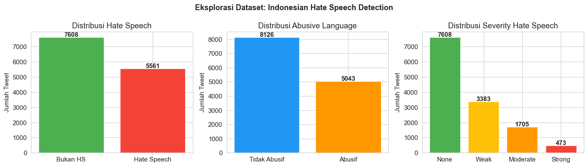

# 🔴 Deteksi Hate Speech Bahasa Indonesia

<p align="center">
  
</p>

<p align="center">
  
  
  
  
</p>

## 📌 Deskripsi Project

Project ini merupakan eksperimen **deteksi hate speech dan abusive language** menggunakan pendekatan hybrid yang menggabungkan **Deep Learning** dan **Fuzzy Logic**.

Model **BiLSTM** digunakan untuk mengekstraksi probabilitas abusive dari teks, kemudian skor tersebut digabungkan dengan fitur linguistik lain sebagai input ke sistem **Fuzzy Mamdani** dan **Fuzzy Sugeno**. Dengan pendekatan ini, project tidak hanya berfokus pada hasil klasifikasi, tetapi juga mencoba mempertahankan interpretabilitas melalui aturan fuzzy.

Project ini dibuat sebagai eksplorasi metode deteksi ujaran kebencian berbasis teks, terutama pada data Twitter berbahasa Indonesia.

---

## 🎯 Tujuan Project

- Melakukan preprocessing teks Bahasa Indonesia, termasuk normalisasi kata tidak baku atau kata "alay".
- Membangun model **BiLSTM** untuk mendeteksi abusive language.
- Mengekstraksi fitur linguistik untuk sistem fuzzy.
- Mengimplementasikan **Fuzzy Logic Mamdani** dan **Fuzzy Logic Sugeno** dari awal.
- Membandingkan performa Mamdani dan Sugeno dalam klasifikasi hate speech.
- Menganalisis dampak integrasi Deep Learning terhadap sistem fuzzy.

---

## 🧠 Arsitektur Sistem

```text
Input Text
    │
    ▼
Preprocessing + Feature Extraction
    │                  │
    ▼                  ▼
BiLSTM Model       Fuzzy Feature Engineering
    │                  │
    └──────┬───────────┘
           ▼
   Fuzzy Mamdani / Sugeno
           │
           ▼
 Severity Score → Label
```

Pada project ini, Deep Learning tidak menggantikan Fuzzy Logic. Model BiLSTM berperan sebagai fitur tambahan berupa `dl_abusive_prob`, sedangkan keputusan akhir tetap dilakukan oleh sistem fuzzy.

---

## 📂 Dataset

Dataset yang digunakan berasal dari penelitian:

> **Multi-label Hate Speech and Abusive Language Detection in Indonesian Twitter**  
> Muhammad Okky Ibrohim & Indra Budi, 2019

Dataset utama memiliki:

- **13.169 data tweet**
- Label **Hate Speech**
- Label **Abusive Language**
- Label target hate speech, seperti individual, group, religion, race, physical, gender, dan other
- Label tingkat hate speech, yaitu weak, moderate, dan strong

File dataset yang digunakan pada repository ini:

```text
├── data.csv
├── abusive.csv
├── new_kamusalay.csv
└── citation.bib
```

---

## ⚙️ Metodologi

### 1. Preprocessing Teks

Tahapan preprocessing meliputi:

- Mengubah teks menjadi lowercase
- Menghapus token khusus seperti `USER`, `RT`, dan `URL`
- Menghapus URL dan karakter non-alfanumerik
- Normalisasi kata alay menggunakan kamus normalisasi
- Menghapus spasi berlebih

### 2. Feature Engineering

Sistem fuzzy menggunakan beberapa fitur utama:

| Fitur             | Deskripsi                              |
| ----------------- | -------------------------------------- |
| `f_abusive_ratio` | Rasio kata abusive dalam tweet         |
| `f_hs_keyword`    | Skor kata kunci hate speech            |
| `f_negativity`    | Skor negasi dan intensifier negatif    |
| `f_target_spec`   | Skor keberadaan target spesifik        |
| `f_dl_abusive`    | Probabilitas abusive dari model BiLSTM |

### 3. Deep Learning dengan BiLSTM

Model BiLSTM digunakan untuk mempelajari pola teks dan menghasilkan probabilitas apakah sebuah tweet mengandung abusive language.

Arsitektur utama:

- Embedding Layer
- Bidirectional LSTM
- Global Max Pooling
- Dense Layer
- Dropout
- Sigmoid Output Layer

### 4. Fuzzy Logic

Project ini mengimplementasikan dua metode fuzzy:

#### Mamdani

- Menggunakan fungsi keanggotaan linguistik
- Menggunakan rule base fuzzy
- Defuzzifikasi menggunakan pendekatan centroid
- Lebih interpretatif dan cocok untuk sistem berbasis aturan linguistik

#### Sugeno

- Menggunakan rule base fuzzy
- Output setiap rule berupa nilai konstan
- Defuzzifikasi menggunakan weighted average
- Lebih sederhana dan efisien secara komputasi

---

## 📊 Hasil Eksperimen

Ringkasan performa dari notebook:

BiLSTM Standalone | Accuracy 0.9169 | F1 0.9158 | AUC 0.9640
Pure Fuzzy Mamdani | Accuracy 0.7154 | F1 0.6783 | AUC 0.8812
Pure Fuzzy Sugeno | Accuracy 0.7113 | F1 0.6724 | AUC 0.9043
Hybrid LSTM + Mamdani | Accuracy 0.6614 | F1 0.6022 | AUC 0.5974
Hybrid LSTM + Sugeno | Accuracy 0.6624 | F1 0.6028 | AUC 0.4892

Dari hasil eksperimen, model **BiLSTM standalone** memiliki performa klasifikasi terbaik. Namun, integrasi BiLSTM ke dalam fuzzy system tetap memberikan peningkatan dibandingkan fuzzy tanpa fitur Deep Learning.

Perbandingan Mamdani dan Sugeno menunjukkan hasil yang sangat mirip, dengan korelasi output sekitar **0.9978**.

---

## 🗃️ Struktur Project

```text
dka-hate-speech-sentiment-analysis/
├── abusive.csv
├── citation.bib
├── data.csv
├── dist_label.png
├── hate_speech_fuzzy_dl.ipynb
├── new_kamusalay.csv
├── requirements.txt
└── README.md
```

---

## 🚀 Cara Menjalankan Project

### 1. Clone repository

```bash
git clone https://github.com/username/dka-hate-speech-sentiment-analysis.git
cd dka-hate-speech-sentiment-analysis
```

### 2. Buat virtual environment

```bash
python -m venv .venv
```

Aktifkan virtual environment:

```bash
# Windows
.venv\Scripts\activate

# Linux / macOS
source .venv/bin/activate
```

### 3. Install dependencies

```bash
pip install -r requirements.txt
```

Apabila `requirements.txt` belum diisi, install package utama berikut:

```bash
pip install numpy pandas matplotlib seaborn scikit-learn tensorflow jupyter
```

### 4. Jalankan notebook

```bash
jupyter notebook hate_speech_fuzzy_dl.ipynb
```

Kemudian jalankan cell notebook dari awal hingga akhir.

---

## 🧪 Teknologi yang Digunakan

- Python
- Jupyter Notebook
- Pandas
- NumPy
- Matplotlib
- Seaborn
- Scikit-learn
- TensorFlow / Keras
- Fuzzy Logic
- Natural Language Processing

---

## 📌 Catatan Penting

Project ini bersifat eksperimental dan edukatif. Model yang dibuat belum ditujukan untuk penggunaan produksi secara langsung. Untuk penggunaan nyata, diperlukan validasi tambahan, pengujian terhadap data baru, penanganan bias, serta evaluasi etis yang lebih mendalam.

Sistem deteksi hate speech sebaiknya digunakan sebagai alat bantu analisis, bukan sebagai satu-satunya dasar pengambilan keputusan terhadap seseorang atau kelompok.

---

## 🔮 Pengembangan Selanjutnya

Beberapa ide pengembangan yang dapat dilakukan:

- Menambahkan pipeline inference untuk input teks baru.
- Menyimpan model hasil training dalam format `.h5` atau `.keras`.
- Membuat script Python terpisah untuk preprocessing, training, dan evaluasi.
- Menambahkan eksperimen model lain seperti IndoBERT.
- Menambahkan visualisasi confusion matrix ke repository.
- Membuat aplikasi sederhana menggunakan Streamlit atau Flask.
- Mengisi `requirements.txt` agar project lebih mudah dijalankan ulang.

---

## 📚 Referensi

Ibrohim, M. O., & Budi, I. (2019). **Multi-label Hate Speech and Abusive Language Detection in Indonesian Twitter**. Proceedings of the Third Workshop on Abusive Language Online, 46–57.

Detail sitasi tersedia pada file:

```text
citation.bib
```

---

## 👤 Author

**Mahesa Bagus Raditya**  
**Fagian Anmila Syamsir**  
**Gillbrian**

---
